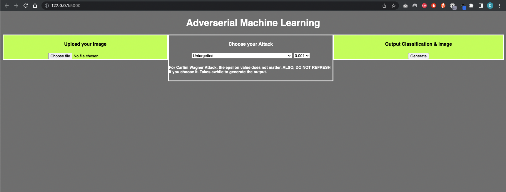
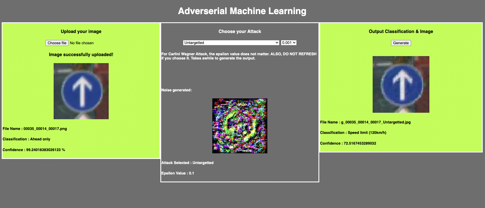
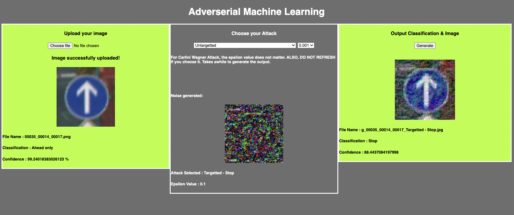
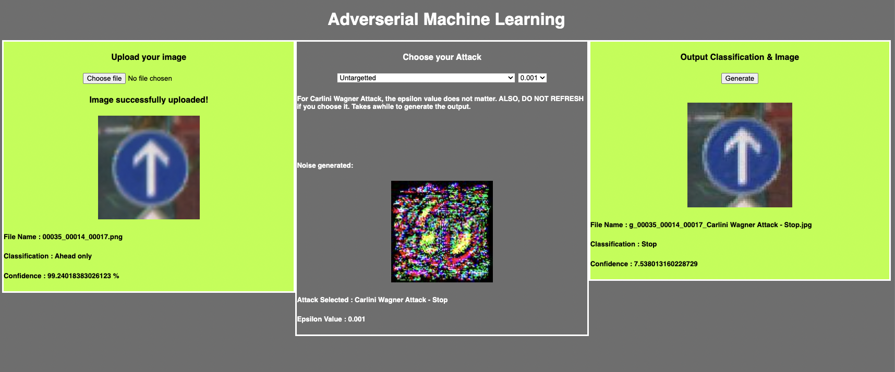

# fakesmart_aiproject
## Team members:
* Yong Sheng Choo
* Yu Hui Lau
* Darryl Tan
* Mah Qing Long Hannah Jean

# Graphical User Interface (GUI)
The GUI is developed in Python with [Flask](https://flask.palletsprojects.com/en/2.1.x/). We chose Flask to develop our GUI because we can easily integrate the image recognition model and attacks that are coded in Python. Flask can render HTML templates which allows us to easily develop the GUI. The image recognition models are generated in Google Colab and the SUTD's GPU cluster. After the image recognition models are generated, we simply need to load the pretrained model into the backend of the Flask microservice. Our GUI is lightweight and should run on machines that support Pytorch.

# Prerequisites
The first step to run our program is to clone Github project. To install the various libraries required to run our program, you can either use [Conda Environment](https://docs.conda.io/projects/conda/en/latest/user-guide/tasks/manage-environments.html) or [Pyenv](https://github.com/pyenv/pyenv). Choosing either of them will let you create a standalone environment dedicated to our program. Also, ensure that you have [pip](https://pip.pypa.io/en/stable/installation/) installed in the environment. Then, you can install all the required libraries using the command:
```BASH
pip3 install -r requirements.txt
```
Then you will need to navigate to the folder, 'data', and download the dataset and put it into this folder. The link can be found in the [readme](https://github.com/yengsheng/fakesmart_aiproject/tree/main/data) in the 'data' folder. Also, in the 'models' folder, you will need to download the pretrained image recognition model. The link can be found in the [readme](https://github.com/yengsheng/fakesmart_aiproject/tree/main/models) in the 'models' folder. With this, you have completed all the prerequisites needed to run our program.

\subsection{Running the GUI}
You can start the GUI by running the command at the root of the project folder:
```BASH
python3 main.py
```
Then, fire up your preferred browser and navigate to http://127.0.0.1:5000/.

# Example Outputs

## Landing Page
The below image shows the landing page of the GUI. The GUI is split into three sections. From left to right, 'Upload your image', 'Choose your attack' and 'Output Classification \& image'.

In the upload section of the GUI, users are able to upload their images to be classified by our image recognition model. For this program, it is preferable to use the dataset that we provided which you have downloaded and found in the 'data' folder. You can choose images from either the 'data/train' or 'data/test' folder for the classification. Users can also run other images of traffic signs found online but the performance might not be ideal.

For the attack section, there are two dropdown menus. The first dropdown allows users to choose what kind of attack they would prefer. There are 87 attacks that the users can choose. There is 1 option for untargeted attack and 43 options each for the targeted and carlini wager attack. For the untargeted and targeted attacks, users will need to choose the epsilon value in the second dropdown.

Lastly, the 'output classification \& image' section, there is a button that will generate the output. This will send the chosen image and selected attack to the backend for processing. The backend will generate the input image classification and confidence. Then, it will apply the chosen attack to the input image. An output image will be generated. The output image will be classified through the same image recognition model and output the classification and confidence. Then, the noise array will be calculated by taking the difference between the input and output image array. The noise image will be generated from the array through 'torchvision.transform.ToPILImage' function. This function automatically normalize the values in the array to a color map.

After the backend has finished processing, it will re-render the webpage and display the input image, classification and confidence in the 'Choose your attack' section. The 'Choose your attack' section will show the noise image, attack chosen and epsilon chosen. The 'Output Classification \& image' will show the generated image, classification and confidence based on the attack.


## Untargeted Attack
For the untargeted attack, there is only 1 option to choose from. User will also need to choose the epsilon value. The higher the epsilon value, the more noise will be added to distort the image. The below image shows an example output of the untargeted attack.

The input image have a classification of 'Ahead only' and confidence of 99.24%. The user has selected untargeted attack with an epsilon value of 0.1. The output classification is 'Speed limit (120km/h)' and confidence of 77.52%. The input, noise and output images are shown in the respective section of the GUI.

## Targeted Attack
For the targeted attack, there are 43 options to choose from. The user can attack the image to their targeted classification. There are 43 classification hence the 43 options. For this attack, user also needs to choose the epsilon values. Like the untargeted attack, the higher the epsilon value, the more noise will be added to distort the image.

The input image have a classification of 'Ahead only' and confidence of 99.24%. The user has selected targeted attack to the 'Stop' class with an epsilon value of 0.1. The output classification is 'Stop' and confidence of 88.44%. The input, noise and output images are shown in the respective section of the GUI.

## Carlini Wagner Attack
For Carlini Wagner attack, there are 43 options to choose from. User can choose their target class for the attack. The epsilon option for this attack can be ignored. The generation of the output image will take quite awhile depending on the computer hardware. With cuda, it will take about 2-5 minutes. With CPU, it will take 7-15 minutes.

The input image have a classification of 'Ahead only' and confidence of 99.24%. The user has selected Carlini Wagner attack to the 'Stop' class. The episilon for this attack does not matter. The output classification is 'Stop' and confidence of 7.54%. The input, noise and output images are shown in the respective section of the GUI.

